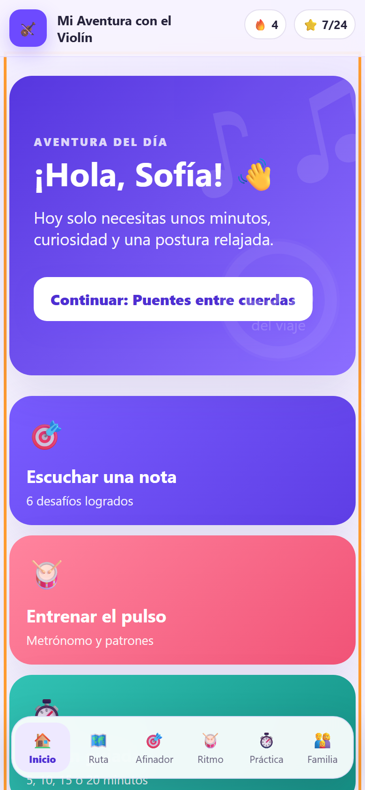
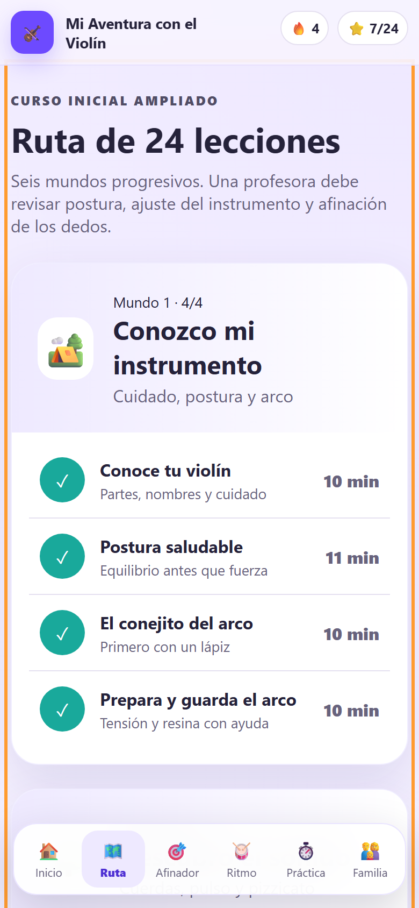
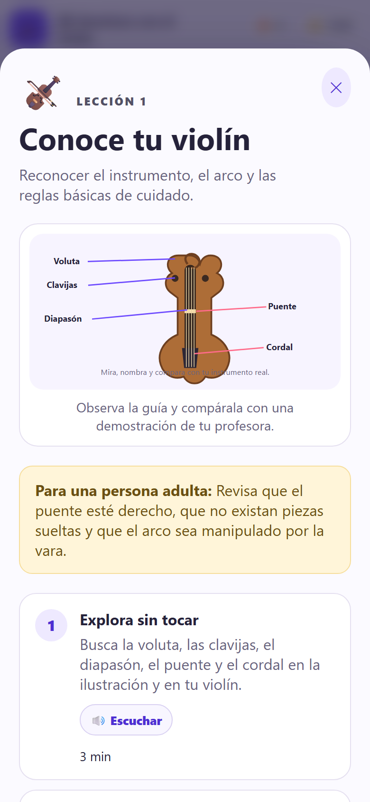
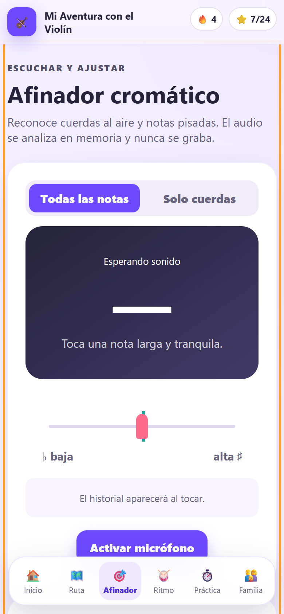
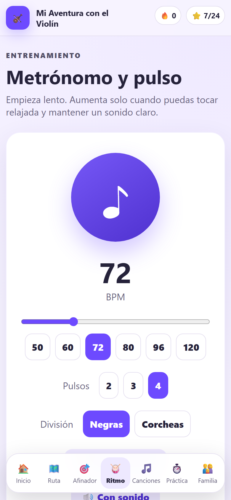
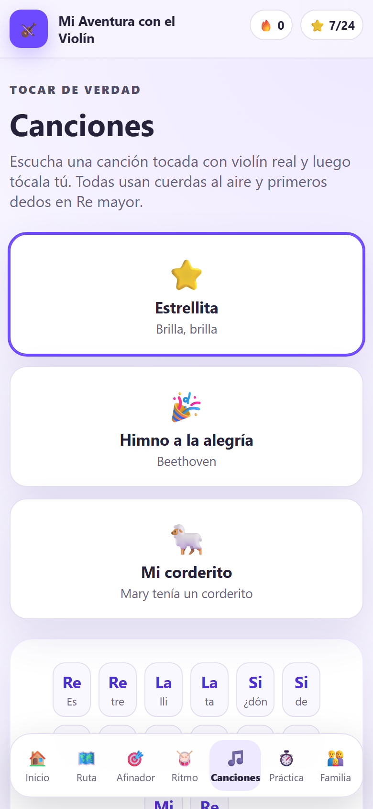
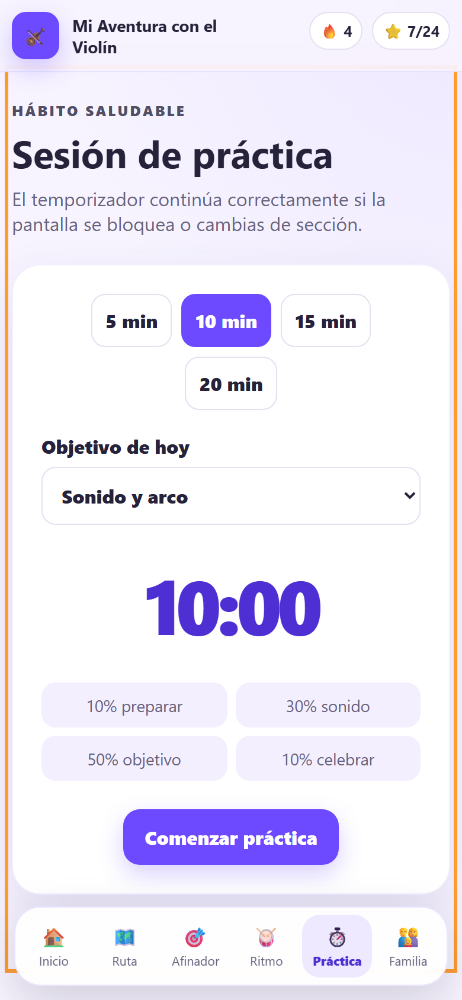
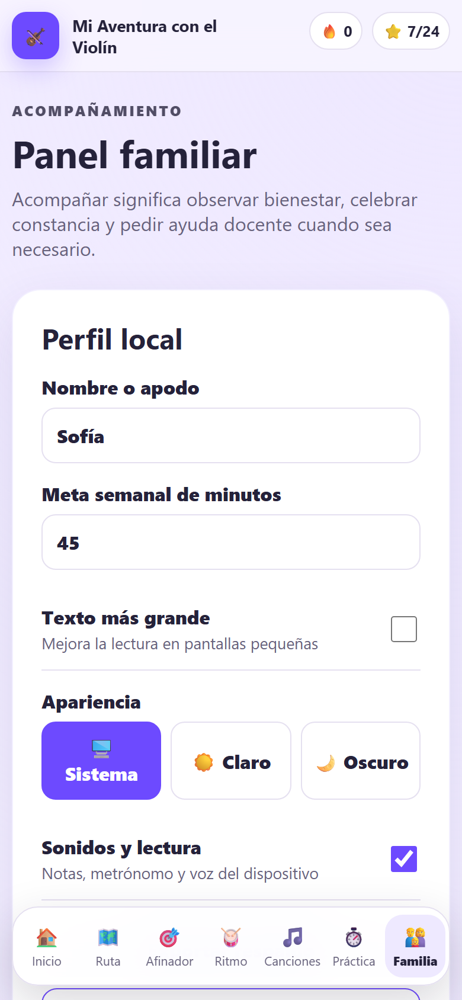
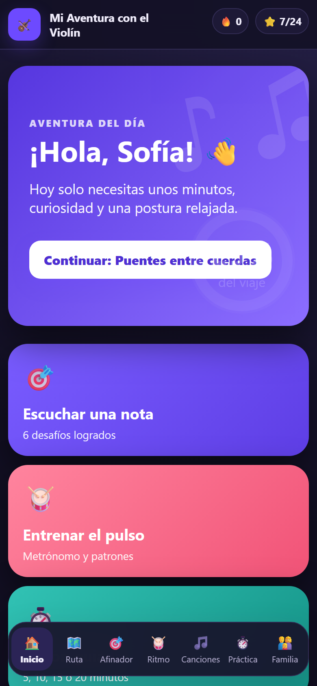
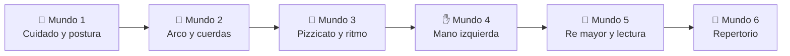

<div align="center">

# 🎻 Mi Aventura con el Violín

## **24 lecciones · 6 mundos · afinador, metrónomo y canciones con violín real**

**Aplicación educativa, privada y sin publicidad para aprender violín desde los 10 años. Una sola base de código para web, Windows, Android, iOS, Linux y macOS mediante Tauri 2.**

[](https://github.com/vladimiracunadev-create/violin-adventure/actions/workflows/ci.yml)
[](https://github.com/vladimiracunadev-create/violin-adventure/actions/workflows/release.yml)

[](CHANGELOG.md)
[](docs/CURRICULUM.md)
[](#-verificar)
[](docs/PRIVACY.md)
[](LICENSE)

[⬇️ Descargar](https://github.com/vladimiracunadev-create/violin-adventure/releases/latest) ·
[🌐 Landing](https://vladimiracunadev-create.github.io/violin-adventure/) ·
[👨‍👩‍👧 Guía para familias](docs/PARENT_GUIDE.md) ·
[🎓 Currículo](docs/CURRICULUM.md) ·
[🏗️ Arquitectura](docs/ARCHITECTURE.md) ·
[🔒 Privacidad](docs/PRIVACY.md) ·
[🗺️ Roadmap](ROADMAP.md)


</div>

---

> [!IMPORTANT]
> La aplicación **complementa, pero no reemplaza**, la observación de una profesora o profesor de violín. La postura, el tamaño del instrumento, la hombrera, la mentonera y la afinación de los dedos requieren revisión humana.

## 📸 Vistazo

|  |  |  |
| :---: | :---: | :---: |
|  |  |  |
| **Inicio** | **Ruta de 24 lecciones** | **Lección con guía visual** |
|  |  |  |
| **Afinador cromático** | **Metrónomo y pulso** | **Canciones con violín real** |
|  |  |  |
| **Sesión de práctica** | **Panel familiar** | **Modo oscuro** |

## ✅ Estado verificable

| Superficie | Evidencia |
|---|---|
| 🎓 **Currículo** | **24 lecciones** en 6 mundos, numeración continua validada en CI · 6 ilustraciones SVG originales |
| 🎯 **Afinación** | Detección por autocorrelación a ~22 Hz · calibración de La entre **432 y 446 Hz** · 10 notas con grabaciones reales de violín |
| 🥁 **Pulso** | Metrónomo agendado sobre el reloj de audio: **0 ms de deriva** medidos en 78 clics a 120 BPM |
| 🧪 **Pruebas** | **41 unitarias** + **7 E2E (Playwright)** en CI, más validadores de repositorio y dominio sin dependencias |
| 📦 **Distribución** | **7 artefactos** por release (`.exe` · `.msi` · `.apk` · `.aab` · `.deb` · `.AppImage` · `.rpm` · `.dmg`) con `SHA256SUMS.txt` |
| 💾 **Datos** | Esquema de progreso v3 con migración desde v1 y v2 · exportación e importación en JSON |
| 🔒 **Privacidad** | Sin servidor, sin cuentas, sin analítica · el micrófono se analiza en memoria y **nunca se graba** · sin cámara ni ubicación |

## 🗺️ La ruta de aprendizaje



Cada lección incluye objetivo, habilidades, pasos guiados, guía visual opcional, pregunta final y recompensa. El panel familiar registra minutos, racha, insignias e historial.

## ✨ Funcionalidades

- **24 lecciones** organizadas en seis mundos progresivos.
- Cuidado, postura, arco, cuerdas, pizzicato, ritmo, mano izquierda, escala de Re mayor, lectura inicial y repertorio.
- Seis ilustraciones SVG originales y accesibles.
- Lectura opcional de instrucciones con la voz instalada en el dispositivo.
- Juego de lectura musical con puntuación persistente.
- **Afinador cromático** para cuerdas al aire y notas pisadas.
- **Notas de referencia con grabaciones reales de violín** (soundfont FluidR3_GM, CC BY 3.0), afinadas por software a la calibración elegida.
- Calibración de La entre 432 y 446 Hz, referencias e historial de estabilidad.
- Desafío auditivo y **modo drone** (sostener la nota) que comprueban localmente una nota.
- **Canciones para tocar** con violín real y modo «Tocar conmigo» que verifica cada nota con el micrófono.
- Metrónomo de 40 a 160 BPM con **pulso exacto** (agendado sobre el reloj de audio, sin deriva), compases de 2, 3 y 4 pulsos, corcheas, **tap-tempo** y **modo visual**.
- **Estado del dispositivo siempre visible** (micrófono, sonido, voz y guardado local) con gestión en el panel familiar e interruptor propio de micrófono.
- **Modo oscuro** (Sistema / Claro / Oscuro) y respeto de movimiento reducido.
- **Gráfico de minutos por semana** en el panel familiar.
- Temporizador recuperable de 5, 10, 15 o 20 minutos.
- Bienvenida inicial, metas semanales, racha, historial e insignias.
- Panel familiar protegible con PIN contra cambios accidentales.
- Exportación, importación y migración del progreso.
- PWA con aviso de instalación, actualización y funcionamiento sin conexión.
- Sin publicidad, analítica, cuenta ni servidor.

> **Android — limitación conocida:** esta versión no se instala sobre una anterior.
> Hay que desinstalar primero, y eso borra el progreso guardado. **Exporta el
> respaldo desde el panel Familia antes de desinstalar** e impórtalo después: el
> procedimiento está en la [guía para familias](docs/PARENT_GUIDE.md#actualizar-la-aplicación-en-android).
> Se resolverá configurando la clave de firma permanente ([cómo](docs/BUILD_MOBILE.md#configurar-la-clave-permanente)).
> En Windows no ocurre: el instalador reemplaza la versión anterior y conserva el progreso.

## ⬇️ Descargar e instalar

Los instaladores se generan automáticamente en GitHub Actions y se publican en la
página de **[Releases](https://github.com/vladimiracunadev-create/violin-adventure/releases)**.

| Plataforma | Archivo | Cómo instalar |
| --- | --- | --- |
| Windows 10/11 | `.exe` (NSIS) o `.msi` | Ejecutar el instalador. Si falta WebView2 se descarga solo. |
| Android 7+ | `.apk` | Permitir "instalar apps desconocidas" y abrir el archivo. |
| Linux | `.AppImage`, `.deb` o `.rpm` | `AppImage`: dar permiso de ejecución y abrir. `.deb`/`.rpm`: instalar con el gestor de paquetes. |
| macOS 10.15+ | `.dmg` | Abrir el `.dmg` y arrastrar la app a Aplicaciones. |
| iOS | `.ipa` | Requiere firma con cuenta Apple Developer (flujo manual). |

> La primera versión de Android se firma con una clave temporal. Para poder
> **actualizar** la app sobre una instalación previa, configura un keystore
> persistente como se explica en [docs/BUILD_MOBILE.md](docs/BUILD_MOBILE.md).

## 🏗️ Arquitectura

```text
React + TypeScript + Vite
          │
          ├── Web / PWA
          └── Tauri 2 + Rust
              ├── Windows   (.msi / .exe)
              ├── Android   (.apk / .aab)
              ├── Linux     (.deb / .AppImage / .rpm)
              ├── macOS     (.dmg universal)
              └── iOS       (.ipa, requiere firma Apple)
```

El micrófono se solicita solo al activar el afinador. El audio se analiza en memoria con Web Audio, no se graba y no se envía a ningún servidor.

## 🚀 Ejecutar en navegador

Requisitos:

- Node.js 22.12 o superior.
- pnpm 10.14 mediante Corepack.

```bash
corepack enable
corepack prepare pnpm@10.14.0 --activate
pnpm install
pnpm dev
```

Abre `http://localhost:1420`.

## 🧪 Verificar

Las verificaciones puras pueden ejecutarse antes de instalar dependencias:

```bash
node scripts/validate-repository.mjs
node --experimental-strip-types scripts/smoke-domain.mjs
node --experimental-strip-types scripts/test-domain.mjs
```

Con dependencias instaladas:

```bash
pnpm validate:repo
pnpm smoke:domain
pnpm test:domain
pnpm test
pnpm build
```

O todo junto:

```bash
pnpm check
```

## 🪟 Windows

Instala Rust, Microsoft C++ Build Tools y WebView2. Luego:

```powershell
pnpm install
pnpm desktop:dev
pnpm desktop:build
```

Los instaladores se generan bajo `src-tauri/target/release/bundle/`. Consulta [docs/BUILD_WINDOWS.md](docs/BUILD_WINDOWS.md).

## 🐧 Linux y macOS

Con Rust y las dependencias del sistema instaladas (en Linux: `libwebkit2gtk-4.1-dev`, `librsvg2-dev`, `patchelf`, `libgtk-3-dev`):

```bash
pnpm install
pnpm desktop:build
```

En Linux se generan `.deb`, `.AppImage` y `.rpm`; en macOS un `.dmg`. Para un `.dmg`
universal (Intel + Apple Silicon): `pnpm tauri build --target universal-apple-darwin`.
En la práctica basta con etiquetar la versión (`v1.3.0`) y dejar que GitHub Actions los compile.
Las pruebas E2E se ejecutan con `pnpm test:e2e` (Playwright).

## 📱 Android e iOS

```bash
pnpm android:init
pnpm android:dev
pnpm android:build
```

```bash
pnpm ios:init
pnpm ios:dev
pnpm ios:build
```

La compilación iOS exige macOS y Xcode. Los scripts configuran permisos de micrófono después de inicializar los proyectos móviles. Consulta [docs/BUILD_MOBILE.md](docs/BUILD_MOBILE.md).

## 🔒 Persistencia y privacidad

El progreso utiliza un esquema local versionado:

- migración automática desde los esquemas 1 y 2;
- escritura temporal antes de reemplazar el dato principal;
- límites y normalización defensiva de importaciones;
- recuperación del temporizador mediante una hora final absoluta;
- respaldo JSON con metadatos de aplicación y formato;
- PIN familiar derivado con PBKDF2 y sal aleatoria.

El PIN solo evita cambios accidentales. No sustituye la protección del sistema operativo ni pretende resistir a una persona con acceso completo al dispositivo.

## 📁 Estructura

```text
violin-adventure/
├── public/                  # PWA, iconos e ilustraciones
├── src/
│   ├── components/         # Bienvenida, insignias y avisos PWA
│   ├── data/               # Currículo de 24 lecciones
│   ├── hooks/              # Accesibilidad de diálogos
│   ├── lib/                # Audio, afinación, datos, PIN y temporizador
│   ├── App.tsx
│   └── styles.css
├── src-tauri/              # Contenedor Windows, Android e iOS
├── scripts/                # Validaciones sin dependencias
├── docs/
└── .github/workflows/       # Ejecución manual para controlar minutos
```

## 📚 Documentación

- [Arquitectura](docs/ARCHITECTURE.md)
- [Currículo completo](docs/CURRICULUM.md)
- [Principios pedagógicos](docs/PEDAGOGY.md)
- [Guía familiar](docs/PARENT_GUIDE.md)
- [Plan orientativo de ocho semanas](docs/PRACTICE_PLAN_8_WEEKS.md)
- [Accesibilidad](docs/ACCESSIBILITY.md)
- [Privacidad infantil](docs/PRIVACY.md)
- [Registro de licencias](docs/CONTENT_LICENSES.md)
- [Revisión docente pendiente](docs/TEACHER_REVIEW.md)
- [Validación técnica](docs/VALIDATION.md)
- [Resultado de esta versión](docs/VALIDATION_RESULT.md)
- [Lista de publicación](docs/RELEASE_CHECKLIST.md)
- [Hoja de ruta](ROADMAP.md)
- [Historial de cambios](CHANGELOG.md)

## 🎯 Estado real

**1.3.0 — requisitos del dispositivo visibles y gestionables.**

La aplicación contiene una experiencia funcional, una arquitectura preparada para distribución y compilación automática de instaladores para Windows, Android, Linux y macOS mediante GitHub Actions. Aunque técnicamente es una versión estable y publicable, todavía no se considera un método pedagógico validado ni un producto aprobado para las tiendas oficiales hasta completar revisión docente, pruebas con familias, auditoría de accesibilidad, ensayos acústicos e instalación en dispositivos reales.

## ⚖️ Licencia

Código, currículo, iconos e ilustraciones propias bajo licencia MIT. Antes de agregar partituras, fotografías, grabaciones o repertorio, confirma su dominio público o licencia de uso y regístralo en [docs/CONTENT_LICENSES.md](docs/CONTENT_LICENSES.md).
